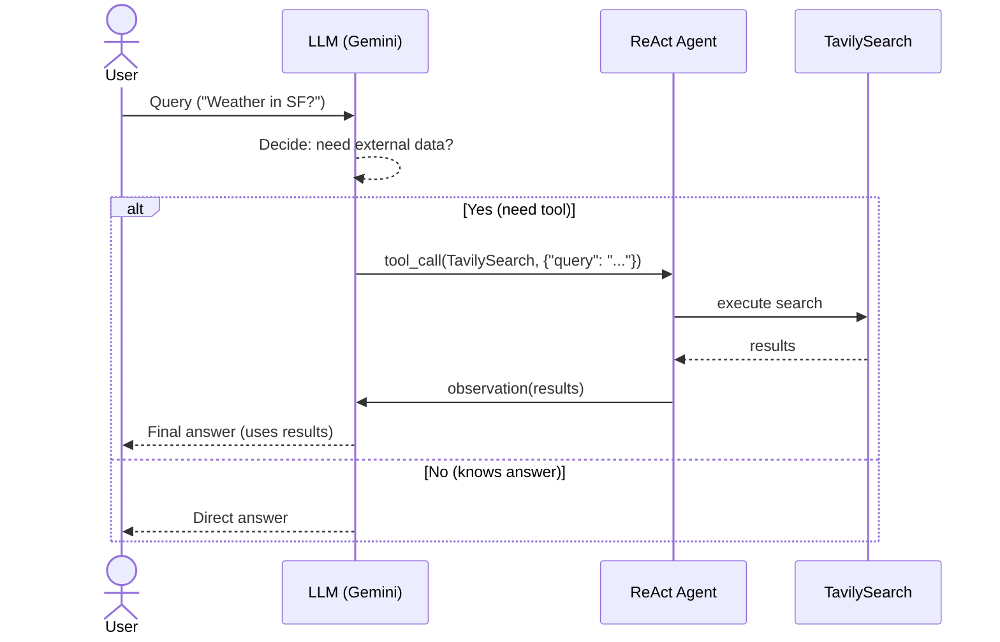

# Agent Working — Behind The Scenes (BTS)

A concise, developer-friendly explainer of how an LLM (e.g., Gemini) decides when to use tools (like TavilySearch), and how a ReAct agent automates the loop in LangChain/LangGraph.
---
# My Learnings - Deductions
# save as generate_llm_vs_agentic_md.py
content = """# LLM vs Agentic Framework (LangChain)

A quick comparison to understand the difference between a **pure LLM** and an **Agentic AI system** (LLM + tools + framework).

---

## 🔎 Core Difference

- **LLM alone = advisor** (tells you what to do).  
- **Agentic AI = executor** (does it for you).  

---

## 🆚 Side-by-Side Comparison

| Aspect | Pure LLM | Agentic Framework (LLMs + Agents + Tools) |
|--------|----------|-------------------------------------------|
| **Workflow** | Input → Think → Respond (static) | Input → Reason → Act (tool call) → Observe → Final Answer |
| **Nature of Output** | Theoretical / Instructions | Actionable / Executed result |
| **Example (Weather in SF?)** | “Open Google and check SF weather.” | *Actually queries API* → “It’s 28°C in SF now.” |
| **Decision Process** | One-shot reasoning | Step-by-step reasoning + external actions |
| **Capabilities** | Text generation only | Text + live search, DB queries, API calls, code execution |
| **User Effort** | User must execute instructions manually | Agent executes automatically |
| **Best For** | Summaries, explanations, brainstorming | Automation, live info, integrated workflows |

---

## 🧭 Short Recap

- **LLMs just give theory:** they output what *should* be done.  
- **Agentic AI does it directly:** by using **tools + reasoning loop**, it completes the task end-to-end.  
"""

out_path = "LLM_vs_Agentic.md"
with open(out_path, "w", encoding="utf-8") as f:
    f.write(content)
print(f"Wrote {out_path}")

---
# In Detail
---
## 🔎 TL;DR

- **LLM has two modes:** 
  1) answer from its **own knowledge**, or 
  2) **call a tool** (e.g., Tavily web search) when it needs fresh or external data.
- **Tool calls** are **structured outputs** the model emits (JSON-like) to ask the framework to execute a tool.
- A **ReAct agent** automates the cycle: *reason → call tool → get result → reason again → final answer*.
- You **don’t pre-train** the LLM with weather/news; it **fetches live info** via tools when needed.

---

## 🧭 End-to-End Flow (Human → LLM → Tools → Answer)

1) **User →** “What’s the weather in SF?”  
2) **LLM (Gemini) checks:** *Do I know this already?*  
   - If **yes**, answer directly (no tools).  
   - If **no**, **emit a tool call** requesting TavilySearch.  
3) **Agent framework** detects tool call → **executes** TavilySearch.  
4) **Tool result** is fed **back into the LLM**.  
5) **LLM** synthesizes a natural-language **final answer** for the user.

### ASCII Diagram

```
USER
  │
  ▼
LLM (Gemini/Claude/etc.)
  │   Can I answer from params + memory?
  ├── YES → Respond directly
  └── NO  → Emit TOOL CALL  ─────┐
                                 │
AGENT (LangGraph ReAct) ◄────────┘
  │ Detect tool call + execute
  ▼
TOOL (TavilySearch API)
  │  ↳ returns live data
  ▼
AGENT feeds results back → LLM reasons again → FINAL ANSWER → USER
```

---

## 🧰 What is Tavily and why is it used?

- **Tavily** is a **search API** (an AI-friendly web search).  
- LLMs are **frozen at training time**; they don’t inherently know today’s **weather**, **news**, **stock prices**, etc.  
- A **tool** like Tavily lets the LLM **fetch live information** on demand.  
- Think of it as an **external memory/knowledge source**.

---

## 🧩 What are “tool calls”?

When you **bind tools** to a model, it gains extra abilities. The model must **signal** when it needs them. It does so by emitting a **structured call** like:

```json
[
  {
    "name": "TavilySearch",
    "args": { "query": "weather in San Francisco right now" }
  }
]
```

This isn’t the answer; it’s the model saying:  
> “To answer the user, **call Tavily** with these arguments.”

Without tool calls, the model is **guessing**. With tool calls, it can **delegate** to real services.

---

## 🧠 Why a ReAct Agent?

- If you only use `bind_tools`, you must **manually** read tool calls, run the tool, and inject results back.  
- A **ReAct agent** (e.g., `create_react_agent`) **automates**:
  - Reason about the query
  - Decide to use a tool
  - Execute the tool
  - Feed results back
  - Produce the **final polished answer**

**You call the agent once**, e.g.:  
```python
response = agent_executor.invoke({"messages": [input_message]})
```

…and it handles **reason → act → observe → reason → answer** for you.

---

## 🔄 The Automation Loop (BTS)

1) **Model responds** with either:
   - A **direct answer**, or
   - A **tool call** (`tool_calls != []`).
2) **Agent detects** tool call → **executes** the function/tool.
3) **Tool output** becomes **context** for the next model step.
4) **Model** integrates the new facts → **final answer**.

> This is the “**Re**ason + **Act**” pattern (ReAct).

---

## 🧪 Two Example Traces

### A) Simple small talk (“Hi!”)
- Input: `"Hi!"`
- LLM: replies directly, **no tool calls**.
- Agent: does nothing extra.
- Output: a greeting.

### B) Live info (“Search for the weather in SF”)
- Input: `"Search for the weather in SF"`
- LLM: emits **tool call** to `TavilySearch` with a query.
- Agent: **executes** Tavily, **injects** the results.
- LLM: writes a **natural summary** (e.g., “It’s 68°F and sunny…”).

---

## 🧱 Minimal Code Patterns (Python, LangChain/LangGraph)

> Pseudocode; adapt to your concrete versions/imports.

```python
from langchain_google_genai import ChatGoogleGenerativeAI
from langchain_tavily import TavilySearch
from langgraph.prebuilt import create_react_agent

# 1) LLM
llm = ChatGoogleGenerativeAI(model="gemini-1.5-pro", temperature=0)

# 2) Tool
tavily = TavilySearch(max_results=5)

# 3) Bind tools (optional if you use the ReAct agent builder that takes tools directly)
llm_with_tools = llm.bind_tools([tavily])

# 4) Create ReAct agent
agent = create_react_agent(llm, tools=[tavily])

# 5) Run
resp = agent.invoke({"messages": [{"role": "user", "content": "Weather in SF?"}]})
print(resp)  # final answer (agent handled tool calls automatically)
```

**Direct tool-call inspection (without full agent):**
```python
msg = [{"role": "user", "content": "Weather in SF?"}]
raw = llm_with_tools.invoke(msg)  # may include tool_calls metadata
if raw.tool_calls:
    # You would manually execute the tool(s) here and feed results back,
    # but the ReAct agent automates this for you.
    pass
```

---

## ✅ Bind Tools vs. ReAct Agent — Quick Compare

| Aspect | `bind_tools` only | ReAct Agent (`create_react_agent`) |
|---|---|---|
| Who executes tools? | **You** manually | **Agent** automatically |
| Loop orchestration | You write state mgmt | Built-in reasoning/acting |
| Best for | Custom pipelines, tight control | Fast integration, fewer footguns |
| Observability | You instrument | Built-in callbacks + your hooks |

---

## 🧠 Common Gotchas & Tips

- **Schema mismatch:** Ensure the **tool signature** (names/args) matches what the LLM emits. Small naming mismatches break tool execution.  
- **Determinism:** Set **`temperature=0`** for more consistent tool-calling behavior in backend automations.  
- **Guardrails:** Validate/clip **tool args** (e.g., max query length) before hitting external APIs.  
- **Timeouts/Retries:** Add sensible **timeouts** and **retry** policies around network tools (Tavily).  
- **Cost/Latency:** Each tool call is an extra **network hop**; cache frequent queries when safe.  
- **Safety:** Sanitize tool outputs; don’t blindly execute commands returned by the model.  
- **Tracing:** Use framework **callbacks** / tracing (LangSmith) to inspect tool-call chains.  
- **Fallbacks:** If the tool fails, let the model **explain** the limitation and offer alternatives.

---

## 🧾 Glossary (Quick)

- **Tool / Function:** An external capability the LLM can request (e.g., web search, DB query).  
- **Tool Call:** Structured message (name + args) emitted by the model to ask the framework to run a tool.  
- **ReAct:** “Reason + Act” interaction pattern for tool-using agents.  
- **Observation:** The tool’s result, given back to the model as context.  
- **Agent:** Orchestrator that cycles reasoning and acting until a final answer.

---

## 🗺️ Sequence Diagram (Mermaid)

> Paste into a Mermaid-enabled viewer to render.



---

## 🧩 Appendix — Practical Config Hints

- **Prompting:** Give the model **clear tool descriptions** and when to use each.  
- **Multi-tool routing:** Provide **short, distinct names**; include usage examples in system prompt.  
- **Stop conditions:** Set a **max tool-steps** to avoid loops; handle “no results” gracefully.  
- **Eval:** Log **tool-call accuracy** (right tool? args correct? results used?) in tests.  
- **Security:** Avoid passing secrets from the model into tools; keep keys server-side.

---

**In short:** You’re wiring an LLM to *think*, decide when to *act* via tools, and then *explain* the answer with fresh data. ReAct agents let you keep code simple while staying robust.
